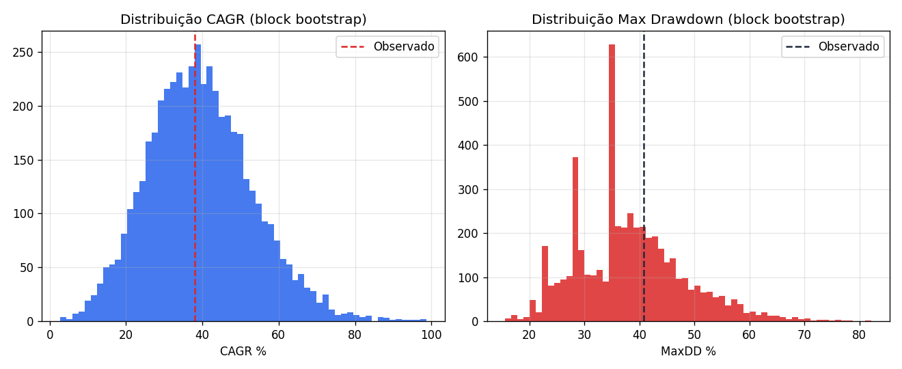
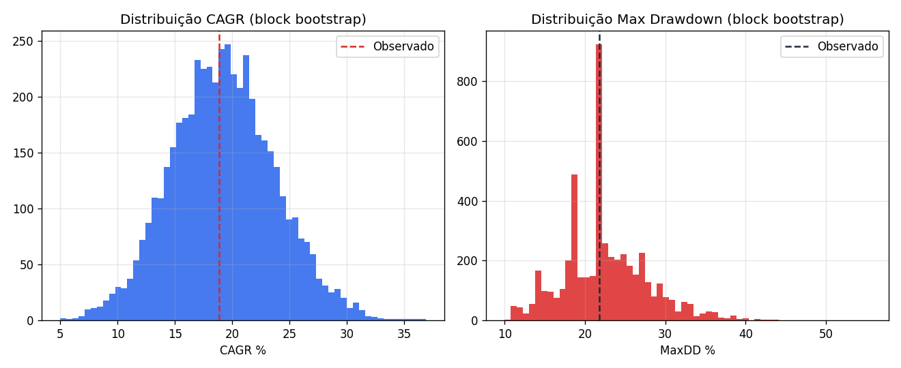

# U2 Momentum — Nasdaq-100 Relative Momentum Bot

Bot de rebalanceamento mensal que aplica uma estratégia de **momentum relativo** sobre o universo Nasdaq-100, executada automaticamente na Trading212 via API.

## Estratégia

- **Universo**: constituintes do Nasdaq-100 (`nasdaq100.csv`, gerado por `gen_nasdaq100.py`).
- **Sinal**: momentum de cada ação *relativo ao SPY* — `(preço / SPY) ` ao longo de um lookback de 126 sessões, com skip dos últimos 21 dias (evita reversão de curto prazo / efeito momentum-crash imediato).
- **Seleção**: top 7 ações com momentum positivo, peso igual.
- **Execução**: rebalanceamento mensal via API da Trading212 (`DRY_RUN=True` por defeito — nunca envia ordens reais sem alteração explícita).
- **Câmbio**: conversão USD→EUR automática (yfinance) para dimensionar ordens na conta europeia.

## Arquitetura

| Ficheiro | Função |
|---|---|
| `gen_nasdaq100.py` | Gera `nasdaq100.csv` (scraping stockanalysis.com → Wikipedia → fallback estático embutido) |
| `u2_bot.py` | Lógica de produção: mapeia tickers Yahoo→T212, calcula ranking de momentum, executa rebalanceamento mensal, regista trades e telemetria |
| `backtest_u2_momentum.py` | Backtest histórico da estratégia vs. SPY/QQQ buy-and-hold (renomeado de `backtest_EMA12.py` — o nome era um resquício de uma versão anterior; o script nunca usou EMA, é o mesmo motor de momentum do `u2_bot.py`) |
| `monte_carlo_robustness.py` | Block bootstrap sobre a equity curve do backtest — quantifica a incerteza estatística à volta do CAGR/MaxDD/Sharpe reportados |

Modos de execução do `u2_bot.py`:
```bash
python3 u2_bot.py --map     # constrói o mapa de instrumentos Yahoo -> T212
python3 u2_bot.py --rank    # mostra o ranking de momentum atual, sem operar
python3 u2_bot.py           # corre o rebalanceamento mensal (respeita DRY_RUN)
```

O `backtest_u2_momentum.py` aceita `--universe` para escolher o CSV de tickers, o que torna os dois testes abaixo reproduzíveis a partir do mesmo script:
```bash
python3 backtest_u2_momentum.py --universe nasdaq100.csv      # Teste 1
python3 backtest_u2_momentum.py --universe universe_2012.csv  # Teste 2
```

## Resultados de Backtest

Dois backtests, sobre dois universos diferentes, cada um com trade-offs distintos de viés:

### 1) Nasdaq-100 atual (lista de hoje aplicada retroativamente a 2014-2026)

| | CAGR | MaxDD | Sharpe | Calmar |
|---|---|---|---|---|
| **U2 Momentum** (completo) | 37.97% | 48.14% | 1.05 | 0.79 |
| U2 Momentum (in-sample, <2022) | 49.31% | 33.44% | 1.29 | 1.47 |
| **U2 Momentum (out-of-sample, ≥2022)** | **23.11%** | 35.74% | 0.73 | 0.65 |
| SPY B&H | 13.76% | 33.72% | 0.83 | 0.41 |
| QQQ B&H | 19.16% | 35.12% | 0.92 | 0.55 |

### 2) 28 mega-caps fixas (universo estático de 2013)

| | CAGR | MaxDD | Sharpe | Calmar |
|---|---|---|---|---|
| **U2 Momentum** (completo) | 18.80% | 25.67% | 0.92 | 0.73 |
| U2 Momentum (in-sample, <2022) | 17.87% | 25.67% | 0.89 | 0.70 |
| **U2 Momentum (out-of-sample, ≥2022)** | **20.30%** | 21.56% | 0.95 | 0.94 |
| QQQ B&H | 19.16% | 35.12% | 0.92 | 0.55 |

### Como interpretar os dois testes

Nenhum dos dois é "o resultado" — são duas leituras da mesma estratégia com vieses opostos:

- **Teste 1 (lista atual)** usa a composição de hoje do Nasdaq-100 aplicada a todo o histórico — isto introduz **survivorship bias**: as ações que sobrevivem para entrar na lista atual são, por definição, as que tiveram bom desempenho, o que infla o CAGR in-sample (49%). O período out-of-sample (≥2022) é o mais recente e o mais informativo sobre performance real esperada — mas mesmo aí não escapa totalmente ao viés, porque a lista usada continua a ser a de 2026, não a lista histórica correta de cada ano.
- **Teste 2 (28 mega-caps fixas de 2013)** não sofre deste viés — o universo é fixo e conhecido antes do período testado — mas é um universo pequeno, desatualizado (não inclui NVDA-era winners recentes de forma justa, nem novas entradas do índice) e não representativo do Nasdaq-100 atual.

**Conclusão honesta**: o teste 1 é mais robusto no período out-of-sample recente (mais parecido com as condições atuais de mercado), mas carrega mais survivorship bias. O teste 2 é mais limpo metodologicamente no in-sample, mas usa um universo desatualizado. Ambos batem o QQQ buy-and-hold no CAGR ajustado a Sharpe/Calmar na maioria dos cortes, mas o max drawdown da estratégia (25-48%) é elevado e deve pesar tanto quanto o CAGR na avaliação. Nenhum destes números deve ser lido como retorno esperado garantido — são o resultado de dois desenhos de teste imperfeitos, cada um a compensar parcialmente a fraqueza do outro.

## Robustez estatística — Block Bootstrap

Os números acima são **um único caminho histórico**. Para saber quão sensível o resultado é à sequência específica de meses que calhou acontecer, `monte_carlo_robustness.py` reamostra os retornos mensais da equity curve em **blocos de 6 meses** (preserva parte da autocorrelação/regime que um bootstrap mês-a-mês destruiria) e reconstrói milhares de histórias alternativas.

```bash
python3 backtest_u2_momentum.py --universe nasdaq100.csv   # gera u2_backtest_equity.csv
python3 monte_carlo_robustness.py --input u2_backtest_equity.csv
```

Output: percentis (p5/p25/mediana/p75/p95) de CAGR, MaxDD e Sharpe sobre os caminhos reamostrados, mais um histograma (`bootstrap_distribution.png`). Isto responde à pergunta que um único backtest não responde: *"se a história tivesse corrido numa ordem ligeiramente diferente, o resultado seria parecido ou foi sorte de sequência?"*

### Resultados (5000 simulações, blocos de 6 meses, 147 retornos mensais / 12.2 anos)

**Teste 1 — Nasdaq-100 atual**

| | CAGR % | MaxDD % | Sharpe |
|---|---|---|---|
| Observado | 38.06 | 40.78 | 1.04 |
| p5 | 18.41 | 22.91 | 0.67 |
| p25 | 29.98 | 30.76 | 0.92 |
| p50 (mediana) | 38.78 | 37.06 | 1.08 |
| p75 | 48.15 | 43.60 | 1.24 |
| p95 | 63.34 | 56.23 | 1.46 |

**Teste 2 — 28 mega-caps fixas (2013)**

| | CAGR % | MaxDD % | Sharpe |
|---|---|---|---|
| Observado | 18.85 | 21.79 | 0.95 |
| p5 | 12.00 | 14.48 | 0.67 |
| p25 | 16.12 | 18.37 | 0.86 |
| p50 (mediana) | 19.17 | 21.79 | 0.98 |
| p75 | 22.16 | 25.60 | 1.11 |
| p95 | 26.82 | 32.22 | 1.30 |




**Leitura honesta:** em ambos os testes, mesmo o percentil 5 (cenário pessimista de reamostragem) fica com CAGR positivo e acima do QQQ B&H — não há um único caminho reamostrado, em 5000, que aponte para prejuízo. Isto é evidência de que o resultado observado não depende de uma sequência de meses particularmente sortuda. Dito isto, o intervalo é largo (ex: 18% a 63% de CAGR no Teste 1) — a estratégia claramente **amplifica tanto o lado bom como o mau** face ao índice, o que é consistente com o MaxDD mais alto (25-56%) do que o QQQ B&H (35%). O Teste 2 tem intervalos mais estreitos e um Sharpe mediano semelhante ao QQQ, refletindo o universo mais pequeno e menos concentrado em poucos vencedores.

Com ~8-12 anos de retornos mensais (96-144 pontos), o bootstrap tem as suas próprias limitações — não inventa dados novos, só quantifica a incerteza dentro do que já foi observado. Trata o intervalo p5-p95 como uma faixa plausível, não como garantia, e nota que ele **não corrige** o survivorship bias do Teste 1, que é um problema dos dados de entrada, não da reamostragem.

## Limitações conhecidas


- Survivorship bias no universo do Teste 1 (ver acima).
- Custos de transação modelados de forma simples: 5 bps por operação (compra e venda), sem modelar slippage nem spread — na prática, para ações líquidas do Nasdaq-100 é uma aproximação razoável, mas otimista para nomes mais ilíquidos.
- Execução real depende da liquidez e do spread da Trading212 para os tickers específicos — não testado em produção com capital real além de dry-run/demo.
- O yfinance pode alterar dados históricos retroativamente (ajustes de dividendos/splits); resultados podem variar ligeiramente entre execuções do backtest.

## Setup

```bash
python3 -m venv venv
source venv/bin/activate
pip install -r requirements.txt   # pandas, numpy, requests, yfinance, python-dotenv, beautifulsoup4

python3 gen_nasdaq100.py          # gera nasdaq100.csv
python3 u2_bot.py --map           # mapeia universo para tickers T212
python3 backtest_u2_momentum.py   # corre o backtest (default: nasdaq100.csv)
```

Cria um `keys.env` (não versionado — ver `.gitignore`) com:
```
T212_API_KEY=...
T212_API_SECRET=...
```

`DRY_RUN=True` por defeito em `u2_bot.py` — nenhuma ordem real é enviada sem alteração explícita do código e da `BASE_URL` para o ambiente live.

## Disclaimer

Projeto pessoal com fins educativos e de portefólio. Não é aconselhamento financeiro. Performance passada (mesmo em backtest sem viés) não garante performance futura.